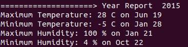
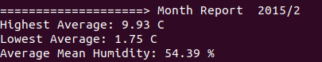

# Weather Man
weatherfiles.zip contains weather data files for Murree in multiple formats. Write an application that generates the following reports. The user can specify more than one report at the same time.
The program should have the following components:
* It should extract the files into a destination folder and execute further tasks as described below.
* A data structure for holding each weather reading.
* A parser for parsing the files and populating the reading data structure with correct data types.
* A data structure for holding the calculations results.
* A module for computing the calculations given the readings.
* A report generator for creating the reports given the computation results.
* PEP-8 conventions should be followed in the code.
* Your code should be concise and self-explanatory and understandable.
 
## 1. For a given year display the highest temperature, the lowest temperature and humidity.
#### Command to execute:

_weatherman.py /path/to/files-dir -e 2002_

#### Example Output:

Highest: 45C on June 23

Lowest: 01C on December 22

Humidity: 95% on August 14

## 2. For a given month display the average highest temperature, average lowest temperature, average mean humidity.
#### Command to execute:

_weatherman.py /path/to/files-dir -a 2005/6_

#### Example Output:

Highest Average: 39C

Lowest Average: 18C

Average Mean Humidity: 71%

## 3. For a given month draw horizontal bar charts on the console for the highest and lowest temperature on each day. Highest in red and lowest in blue.
#### Command to execute:

_weatherman.py /path/to/files-dir -c 2011/03_

#### Example Output:

March 2011

01 +++++++++++++++++++++++++ 25C

01 +++++++++++ 11C

02 ++++++++++++++++++++++ 22C

02 ++++++++ 08C

## 4. Multiple Reports should be generated if multiple available options are passed to application
#### Command to execute:
_weatherman.py /path/to/files-dir -c 2011/03 -a 2011/3 -e 2011_

## 5. BONUS TASK. For a given month draw one horizontal bar chart on the console for the highest and lowest temperature on each day. Highest in red and lowest in blue.
#### Command to execute:
_weatherman.py /path/to/files-dir -b 2011/3_
#### Example output:
March 2011

01 ++++++++++++++++++++++++++++++++++++ 11C - 25C

02 ++++++++++++++++++++++++++++++ 08C - 22C

# Virtual Environment
### Install virtualenv and virtualenvwrapper
_pip install virtualenv_

_pip install virtualenvwrapper_
### Add variables to path (Recommended)

export WORKON_HOME=$HOME/.virtualenv

export PROJECT_HOME=$HOME/projects
### Find virtualenvwrapper and run it
_which virtualenvwrapper.sh_

_The command will output a path similar to this "/usr/local/bin/virtualenvwrapper.sh"_

Enter the following command to run this file

_source /usr/local/bin/virtualenvwrapper.sh_

### Reload startup file ".bashrc"
_source ~/.bashrc_

### Create a new virtual environment
_mkvirtualenv env-name_

This environment will be loaded automatically after successful creation, if it is not loaded use 

_workon env-name_

### Useful virtual environment commands
<ul>
<li>To create an environment

_mkvirtualenv env-name_
</li>
<li>
To change working environment

_workon env-name_
</li>
<li> Remove a virtual environment

_rmvirtualenv env-name_
</li>
<li> Deactivate the environment (Go back to use system python)

_deactivate_

</li>

</ul>

# Usage
<ul>

### <li>For yearly report, execute
python3 weatherman.py path/to/all/files -e year
#### Example
python3 weatherman.py weatherfiles/ -e 2014

</li>

### <li>For monthly report, execute
python3 weatherman.py path/to/all/files -a year/month
#### Example
python3 weatherman.py weatherfiles/ -a 2014/06

</li>

### <li>For monthly graph (two lines), execute
python3 weatherman.py path/to/all/files -c year/month
#### Example
python3 weatherman.py weatherfiles/ -c 2014/06

 output")</li>

### <li>For monthly graph (single line), execute
python3 weatherman.py path/to/all/files -b year/month
#### Example
python3 weatherman.py weatherfiles/ -b 2014/06

 output")</li>

</ul>
